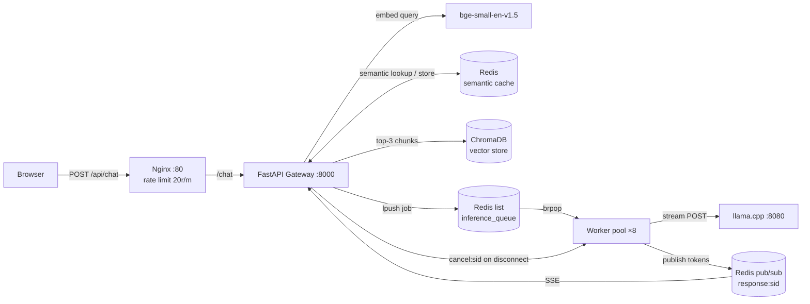
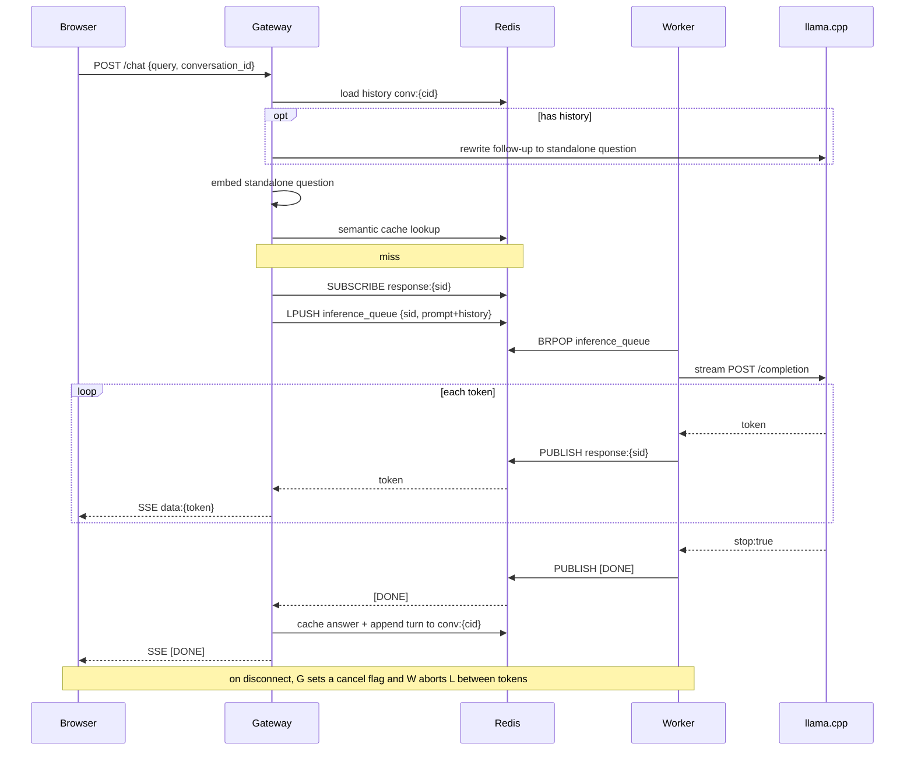

# Helix Chatbot

[](https://github.com/himanishpuri/helix_chatbot/actions/workflows/ci.yml)

A RAG (Retrieval-Augmented Generation) chatbot that runs entirely on local hardware. Queries a college knowledge base using ChromaDB for semantic search, caches responses in Redis to avoid redundant inference, and streams tokens back to the client in real time via Server-Sent Events.

---

## Features

- **Retrieval-Augmented Generation** — embeds each query with `bge-small-en-v1.5` (swap via `EMBED_MODEL`), retrieves the top-3 most relevant chunks from ChromaDB, and injects them into the prompt so the model answers only from verified knowledge.
- **Conversational memory** — turns are stored per `conversation_id` in Redis (`conv:{id}`, trimmed to the last `MAX_HISTORY_MSGS`, 1-hour TTL). A follow-up like _"when is it?"_ is first rewritten into a standalone question (_"when is HELIX?"_) by a short LLM call, so retrieval and caching key off the real intent; the prior turns are also fed into the answer prompt so pronouns resolve during generation.
- **Swappable model presets** — the chat template and stop tokens for the LLM live in one place (`gateway/templates.py`) keyed by family (`phi3`, `qwen`, `llama3`). Point llama.cpp at a different GGUF and match it with a one-word `MODEL_PRESET` change — no code edit.
- **Semantic cache (vector KNN)** — before hitting the inference stack, the query embedding runs a `KNN 1` search over a Redis vector index (`FT.SEARCH`, HNSW/cosine) — approximate nearest-neighbour, ~O(log N) instead of scanning every entry. A match at ≥ 0.92 similarity returns the cached answer instantly (7-day TTL, refreshed on hit). If the Redis Query Engine isn't present, it degrades gracefully to a linear cosine scan.
- **Local LLM inference** — delegates generation to a llama.cpp server running on the host. No external API calls, no data leaves the machine.
- **Async worker pool** — 8 async workers dequeue jobs from a Redis list and call llama.cpp in parallel, keeping latency low under concurrent load.
- **Real-time token streaming** — workers publish tokens to a Redis pub/sub channel; the gateway forwards them to the browser as Server-Sent Events the moment they arrive.
- **Job cancellation on disconnect** — if the client closes the connection mid-stream, the gateway sets a `cancel:{session_id}` flag in Redis; the worker checks it between tokens and aborts the llama.cpp stream, freeing inference capacity instead of generating into the void.
- **Rate limiting via Nginx** — 20 requests/minute per IP with a burst of 10 (delayed after 5), enforced at the proxy layer before reaching the application.

---

## Architecture



### Request flow (cache miss)



---

## Tech Stack

| Layer            | Technology                                                       |
| ---------------- | ---------------------------------------------------------------- |
| Web framework    | FastAPI + Uvicorn                                                |
| Reverse proxy    | Nginx (Alpine)                                                   |
| Embeddings       | `sentence-transformers` — `bge-small-en-v1.5` (env-configurable) |
| Vector store     | ChromaDB (persistent, cosine metric)                             |
| Cache & queue    | Redis 8 (Query Engine for vector KNN)                            |
| LLM inference    | llama.cpp (`llama-server`)                                       |
| HTTP client      | httpx (async)                                                    |
| Streaming        | Server-Sent Events via FastAPI `StreamingResponse`               |
| Containerisation | Docker Compose                                                   |

---

## Design Decisions

- **Redis pub/sub for streaming, not direct gateway→llama.cpp.** Decoupling the gateway from inference via a queue + pub/sub means the web tier stays responsive and stateless: workers can be scaled independently, and a slow model never ties up an HTTP worker thread. The gateway subscribes _before_ enqueuing the job so no leading tokens are lost to the pub/sub's no-backlog semantics.
- **Semantic cache threshold of 0.92.** High enough that only genuine paraphrases hit (avoiding wrong-answer reuse), low enough to catch "what courses are offered" vs "which courses do you offer". Below it, the query goes to full RAG + inference.
- **Vector KNN for the cache, with a scan fallback.** The cache lookup is a Redis vector `KNN 1` search (HNSW, cosine) — approximate nearest-neighbour in ~O(log N), so it stays fast as the cache grows instead of the naive O(N) scan of comparing every stored embedding. It needs the Redis Query Engine (bundled in `redis:8`); if that's absent the code falls back to the linear scan, so the gateway boots against any Redis and simply uses whichever backend is available. The KB retrieval in ChromaDB is likewise ANN (HNSW).
- **Query rewrite over naive history-prepend.** For follow-ups, condensing the conversation into one standalone question (via a short, deterministic LLM call) keeps two things clean that prepending raw history would muddy: retrieval embeds a focused question instead of a blob of prior turns, and the semantic cache keys on intent — "when is it?" and "when is HELIX?" resolve to the same cached answer. The rewrite is skipped entirely on the first turn.
- **Local llama.cpp inference.** Keeps student/college data on-machine, removes per-token API cost, and makes the whole stack runnable on a laptop with a single GGUF file.
- **`bge-small-en-v1.5` embedder.** Same 384 dimensions and inference cost as the old `all-MiniLM-L6-v2` but noticeably stronger retrieval on the MTEB benchmarks. bge models are trained to embed a _query_ with a short instruction prefix (applied automatically at query time, never to the stored documents), which lifts retrieval further at zero extra cost.
- **Model presets over hardcoded templates.** Each LLM family needs its own chat wrapper and stop sequences; keeping them together in `templates.py` means the two can't drift apart, and switching hardware (M1 → Intel, or one GGUF → another) is a single env var rather than a code change across two files.
- **Paragraph-packed chunking with overlap.** Chunks are packed to ~`CHUNK_SIZE` on paragraph boundaries (natural semantic units), oversized paragraphs are hard-split, and each chunk carries `CHUNK_OVERLAP` trailing characters into the next so an answer spanning a chunk boundary isn't cut mid-idea. Chunk IDs are MD5 hashes of their text, so re-ingesting unchanged content is a no-op.

---

## Performance

Measured numbers depend heavily on the host GPU/CPU and the chosen GGUF model, so they're not baked in here. The architecture's design targets:

- **Cache hits** return in a few ms (Redis lookup + local cosine scan) versus full-model latency on a miss.
- **8 concurrent workers** let independent queries generate in parallel rather than serialising on a single llama.cpp connection.
- **Cancellation on disconnect** reclaims a worker within ~`CANCEL_CHECK_EVERY` (8) tokens of the client leaving.

> Populate this section with real numbers from your hardware: single-query latency, tokens/sec, cache-hit latency, and throughput under N concurrent clients.

---

## Choosing a Model

The LLM is served by llama.cpp on the host — you pick the GGUF and set the matching
`MODEL_PRESET`. Suggested pairings by hardware:

| Hardware                           | Suggested GGUF              | `MODEL_PRESET` | Notes                                                                         |
| ---------------------------------- | --------------------------- | -------------- | ----------------------------------------------------------------------------- |
| **Apple M1 Max** (Metal)           | Qwen2.5-7B-Instruct Q4_K_M  | `qwen`         | ~40–60 tok/s; bump `EMBED_MODEL=BAAI/bge-base-en-v1.5` for stronger retrieval |
| M1 Max, larger                     | Qwen2.5-14B-Instruct Q4_K_M | `qwen`         | needs 32GB+ unified memory                                                    |
| **Intel i5-1335U / Iris Xe** (CPU) | Qwen2.5-3B-Instruct Q4_K_M  | `qwen`         | ~8–15 tok/s CPU                                                               |
| Intel, zero-config                 | Phi-3.5-mini Q4_K_M         | `phi3`         | matches the default preset                                                    |
| Any Llama-3.x GGUF                 | Llama-3.1/3.2-Instruct      | `llama3`       | —                                                                             |

Start llama.cpp, then switch preset with an env var — no rebuild of app code:

```bash
# on the Intel laptop, for example:
MODEL_PRESET=qwen docker compose up -d
```

> Presets set the chat template + stop tokens only. Changing `EMBED_MODEL` (the retrieval
> model) has different dimensions, so you must **re-run ingestion** after changing it.

---

## Prerequisites

- Docker and Docker Compose
- A llama.cpp build with a compatible GGUF model
- Python 3.11+ and [`uv`](https://github.com/astral-sh/uv) (to run the ingestion script)

---

## Quick Start

### 1. Run the llama.cpp server (on the host, outside Docker)

```bash
llama.cpp/build/bin/llama-server -m /path/to/model.gguf --port 8080
```

The Docker containers reach this via `host.docker.internal:8080`.

### 2. Ingest the knowledge base

Run once to chunk `college_data.md`, embed it, and populate ChromaDB:

```bash
cd chatbot/ingestion
uv sync            # installs chromadb + sentence-transformers
uv run python ingest.py
```

This writes the vector database to `chatbot/data/chroma_db/`, which is mounted into the gateway and worker containers.

You can also run ingestion in a container (no host Python needed):

```bash
cd chatbot
docker compose --profile ingest run --rm ingest
```

### 3. Start all services

```bash
cd chatbot
docker-compose up
```

This starts four containers:

| Service   | Port            | Role                                          |
| --------- | --------------- | --------------------------------------------- |
| `redis`   | 6379 (internal) | Job queue and semantic cache                  |
| `gateway` | 8000            | FastAPI app                                   |
| `worker`  | —               | 8 async inference workers                     |
| `nginx`   | 80              | Rate-limiting reverse proxy + static frontend |

Open `http://localhost/` for the chat UI, or call the API at `http://localhost/api/chat`.

### 4. Send a query

```bash
curl -N -X POST http://localhost/api/chat \
  -H "Content-Type: application/json" \
  -d '{"query": "What courses are offered?"}'
```

Tokens arrive as SSE events:

```
data: {"token": "The"}
data: {"token": " college"}
...
data: [DONE]
```

> The session id is generated server-side (it names the pub/sub channel), so clients don't send one.

---

## Running Without Docker

The gateway uses flat imports (`from cache import ...`), so run it from inside `gateway/`:

```bash
# Terminal 1 — Redis
redis-server

# Terminal 2 — llama.cpp
llama.cpp/build/bin/llama-server -m /path/to/model.gguf --port 8080

# Terminal 3 — Gateway
cd chatbot/gateway
uv run uvicorn main:app --port 8000

# Terminal 4 — Workers
cd chatbot/gateway
uv run python worker.py
```

---

## Configuration

All tunable constants live at the top of their respective files:

| File                  | Constant               | Default                            | Description                                                                        |
| --------------------- | ---------------------- | ---------------------------------- | ---------------------------------------------------------------------------------- |
| `gateway/main.py`     | `TOP_K_CHUNKS`         | `3`                                | Chunks retrieved from ChromaDB per query                                           |
| `gateway/main.py`     | `COLLEGE_NAME`         | `ABC Institute of Technology`      | Injected into the system prompt (env `COLLEGE_NAME`)                               |
| `gateway/main.py`     | `MAX_QUERY_LEN`        | `2000`                             | Max accepted query length (chars)                                                  |
| `gateway/main.py`     | `MODEL_PRESET`         | `phi3`                             | LLM chat template + stop tokens (`phi3`/`qwen`/`llama3`); read by gateway + worker |
| `gateway/main.py`     | `EMBED_MODEL`          | `BAAI/bge-small-en-v1.5`           | Embedding model; **must match** between gateway and ingestion                      |
| `gateway/main.py`     | `CONV_TTL`             | `3600`                             | Conversation-memory lifetime (seconds)                                             |
| `gateway/main.py`     | `MAX_HISTORY_MSGS`     | `12`                               | Messages kept per conversation (~6 turns)                                          |
| `gateway/main.py`     | `REWRITE_MAX_TOKENS`   | `64`                               | Token budget for the standalone-question rewrite                                   |
| `gateway/cache.py`    | `SIMILARITY_THRESHOLD` | `0.92`                             | Cosine similarity required for a cache hit                                         |
| `gateway/cache.py`    | `CACHE_TTL`            | `604800`                           | Cache entry lifetime (7 days, in seconds)                                          |
| `gateway/worker.py`   | `NUM_WORKERS`          | `8`                                | Parallel inference workers                                                         |
| `gateway/worker.py`   | `LLAMA_URL`            | `http://localhost:8080/completion` | llama.cpp endpoint                                                                 |
| `ingestion/ingest.py` | `CHUNK_SIZE`           | `500`                              | Target characters per chunk                                                        |
| `ingestion/ingest.py` | `CHUNK_OVERLAP`        | `100`                              | Trailing characters carried into the next chunk                                    |

**Docker environment variables** (set in `docker-compose.yml`):

| Variable       | Value                                         | Used by         |
| -------------- | --------------------------------------------- | --------------- |
| `REDIS_HOST`   | `redis`                                       | gateway, worker |
| `LLAMA_URL`    | `http://host.docker.internal:8080/completion` | gateway, worker |
| `CHROMA_PATH`  | `/app/data/chroma_db`                         | gateway, ingest |
| `MODEL_PRESET` | `phi3`                                        | gateway, worker |
| `EMBED_MODEL`  | `BAAI/bge-small-en-v1.5`                      | gateway, ingest |

---

## Knowledge Base

The knowledge base lives in `chatbot/ingestion/college_data.md`. Edit that file, then re-run the ingestion script to update ChromaDB:

```bash
cd chatbot/ingestion
uv run python ingest.py
```

Chunk IDs are content hashes, so unchanged chunks are skipped on re-ingest and only new/edited content is added.

---

## Tests

Logic that isn't obvious carries a runnable check (no external services needed):

```bash
cd chatbot/gateway && uv run python test_cache.py      # cache best-match + cosine guard
cd chatbot/ingestion && uv run python ingest.py --selfcheck   # chunking overlap + edge cases
```

---

## Key Files

```
chatbot/
├── docker-compose.yml        — orchestrates Redis, Gateway, Worker, Nginx
├── gateway/
│   ├── main.py               — FastAPI app; /chat (SSE), memory + query-rewrite, /health
│   ├── cache.py              — semantic cache: scan + best-match cosine + atomic set
│   ├── worker.py             — dequeues jobs, streams llama.cpp, publishes tokens, honours cancel
│   ├── templates.py          — per-family chat template + stop tokens (MODEL_PRESET)
│   ├── test_cache.py         — cache unit checks (no Redis)
│   ├── test_templates.py     — preset template/stop checks (no services)
│   └── Dockerfile
├── ingestion/
│   ├── ingest.py             — chunks college_data.md (overlap), embeds, stores in ChromaDB
│   └── college_data.md       — knowledge base source
├── nginx/
│   └── nginx.conf            — rate limiting, SSE proxy headers, static frontend
├── frontend/
│   └── index.html            — streaming chat UI (vanilla JS, no build step)
└── data/
    └── chroma_db/            — persisted vector database
```
