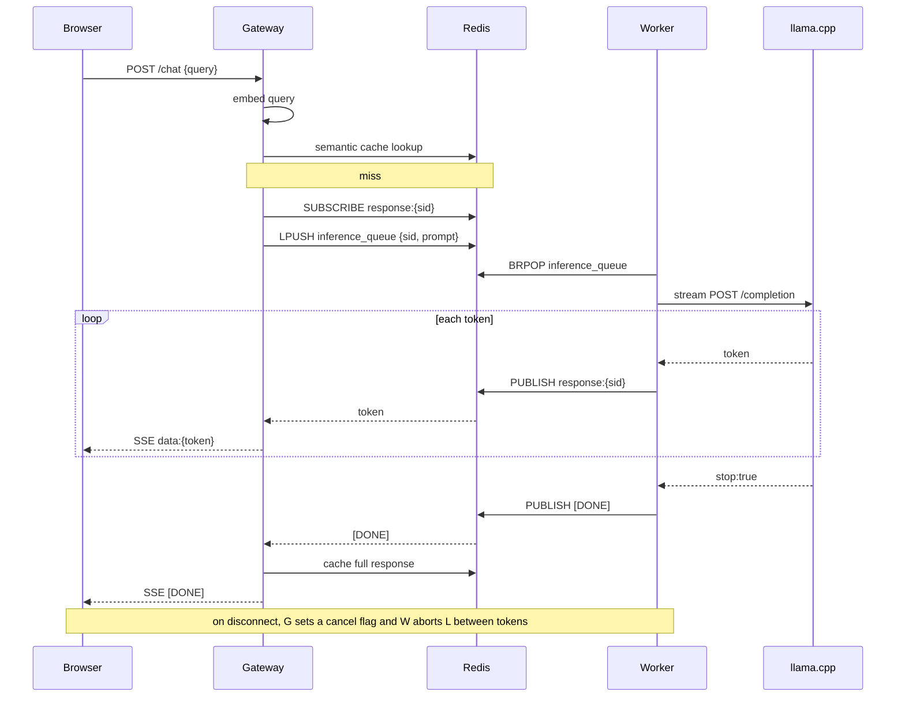

# Helix Chatbot

A RAG (Retrieval-Augmented Generation) chatbot that runs entirely on local hardware. Queries a college knowledge base using ChromaDB for semantic search, caches responses in Redis to avoid redundant inference, and streams tokens back to the client in real time via Server-Sent Events.

---

## Features

- **Retrieval-Augmented Generation** — embeds each query with `all-MiniLM-L6-v2`, retrieves the top-3 most relevant chunks from ChromaDB, and injects them into the prompt so the model answers only from verified knowledge.
- **Semantic cache** — before hitting the inference stack, every query is compared against cached embeddings in Redis by cosine similarity. The closest match at ≥ 0.92 similarity returns the cached answer instantly, with its 7-day TTL refreshed on hit.
- **Local LLM inference** — delegates generation to a llama.cpp server running on the host. No external API calls, no data leaves the machine.
- **Async worker pool** — 8 async workers dequeue jobs from a Redis list and call llama.cpp in parallel, keeping latency low under concurrent load.
- **Real-time token streaming** — workers publish tokens to a Redis pub/sub channel; the gateway forwards them to the browser as Server-Sent Events the moment they arrive.
- **Job cancellation on disconnect** — if the client closes the connection mid-stream, the gateway sets a `cancel:{session_id}` flag in Redis; the worker checks it between tokens and aborts the llama.cpp stream, freeing inference capacity instead of generating into the void.
- **Rate limiting via Nginx** — 20 requests/minute per IP with a burst of 10 (delayed after 5), enforced at the proxy layer before reaching the application.

---

## Architecture


### Request flow (cache miss)



---

## Tech Stack

| Layer            | Technology                                         |
| ---------------- | -------------------------------------------------- |
| Web framework    | FastAPI + Uvicorn                                  |
| Reverse proxy    | Nginx (Alpine)                                     |
| Embeddings       | `sentence-transformers` — `all-MiniLM-L6-v2`       |
| Vector store     | ChromaDB (persistent, cosine metric)               |
| Cache & queue    | Redis 7                                            |
| LLM inference    | llama.cpp (`llama-server`)                         |
| HTTP client      | httpx (async)                                      |
| Streaming        | Server-Sent Events via FastAPI `StreamingResponse` |
| Containerisation | Docker Compose                                     |

---

## Design Decisions

- **Redis pub/sub for streaming, not direct gateway→llama.cpp.** Decoupling the gateway from inference via a queue + pub/sub means the web tier stays responsive and stateless: workers can be scaled independently, and a slow model never ties up an HTTP worker thread. The gateway subscribes _before_ enqueuing the job so no leading tokens are lost to the pub/sub's no-backlog semantics.
- **Semantic cache threshold of 0.92.** High enough that only genuine paraphrases hit (avoiding wrong-answer reuse), low enough to catch "what courses are offered" vs "which courses do you offer". Below it, the query goes to full RAG + inference. The cache returns the _best_ match above threshold, not the first found.
- **Local llama.cpp inference.** Keeps student/college data on-machine, removes per-token API cost, and makes the whole stack runnable on a laptop with a single GGUF file.
- **Paragraph-packed chunking with overlap.** Chunks are packed to ~`CHUNK_SIZE` on paragraph boundaries (natural semantic units), oversized paragraphs are hard-split, and each chunk carries `CHUNK_OVERLAP` trailing characters into the next so an answer spanning a chunk boundary isn't cut mid-idea. Chunk IDs are MD5 hashes of their text, so re-ingesting unchanged content is a no-op.

---

## Performance

Measured numbers depend heavily on the host GPU/CPU and the chosen GGUF model, so they're not baked in here. The architecture's design targets:

- **Cache hits** return in a few ms (Redis lookup + local cosine scan) versus full-model latency on a miss.
- **8 concurrent workers** let independent queries generate in parallel rather than serialising on a single llama.cpp connection.
- **Cancellation on disconnect** reclaims a worker within ~`CANCEL_CHECK_EVERY` (8) tokens of the client leaving.

> Populate this section with real numbers from your hardware: single-query latency, tokens/sec, cache-hit latency, and throughput under N concurrent clients.

---

## Prerequisites

- Docker and Docker Compose
- A llama.cpp build with a compatible GGUF model
- Python 3.11+ and [`uv`](https://github.com/astral-sh/uv) (to run the ingestion script)

---

## Quick Start

### 1. Run the llama.cpp server (on the host, outside Docker)

```bash
llama.cpp/build/bin/llama-server -m /path/to/model.gguf --port 8080
```

The Docker containers reach this via `host.docker.internal:8080`.

### 2. Ingest the knowledge base

Run once to chunk `college_data.md`, embed it, and populate ChromaDB:

```bash
cd chatbot/ingestion
uv sync            # installs chromadb + sentence-transformers
uv run python ingest.py
```

This writes the vector database to `chatbot/data/chroma_db/`, which is mounted read-only into the gateway container.

### 3. Start all services

```bash
cd chatbot
docker-compose up
```

This starts four containers:

| Service   | Port            | Role                                          |
| --------- | --------------- | --------------------------------------------- |
| `redis`   | 6379 (internal) | Job queue and semantic cache                  |
| `gateway` | 8000            | FastAPI app                                   |
| `worker`  | —               | 8 async inference workers                     |
| `nginx`   | 80              | Rate-limiting reverse proxy + static frontend |

Open `http://localhost/` for the chat UI, or call the API at `http://localhost/api/chat`.

### 4. Send a query

```bash
curl -N -X POST http://localhost/api/chat \
  -H "Content-Type: application/json" \
  -d '{"query": "What courses are offered?"}'
```

Tokens arrive as SSE events:

```
data: {"token": "The"}
data: {"token": " college"}
...
data: [DONE]
```

> The session id is generated server-side (it names the pub/sub channel), so clients don't send one.

---

## Running Without Docker

The gateway uses flat imports (`from cache import ...`), so run it from inside `gateway/`:

```bash
# Terminal 1 — Redis
redis-server

# Terminal 2 — llama.cpp
llama.cpp/build/bin/llama-server -m /path/to/model.gguf --port 8080

# Terminal 3 — Gateway
cd chatbot/gateway
uv run uvicorn main:app --port 8000

# Terminal 4 — Workers
cd chatbot/gateway
uv run python worker.py
```

---

## Configuration

All tunable constants live at the top of their respective files:

| File                  | Constant               | Default                            | Description                                          |
| --------------------- | ---------------------- | ---------------------------------- | ---------------------------------------------------- |
| `gateway/main.py`     | `TOP_K_CHUNKS`         | `3`                                | Chunks retrieved from ChromaDB per query             |
| `gateway/main.py`     | `COLLEGE_NAME`         | `ABC Institute of Technology`      | Injected into the system prompt (env `COLLEGE_NAME`) |
| `gateway/main.py`     | `MAX_QUERY_LEN`        | `2000`                             | Max accepted query length (chars)                    |
| `gateway/cache.py`    | `SIMILARITY_THRESHOLD` | `0.92`                             | Cosine similarity required for a cache hit           |
| `gateway/cache.py`    | `CACHE_TTL`            | `604800`                           | Cache entry lifetime (7 days, in seconds)            |
| `gateway/worker.py`   | `NUM_WORKERS`          | `8`                                | Parallel inference workers                           |
| `gateway/worker.py`   | `LLAMA_URL`            | `http://localhost:8080/completion` | llama.cpp endpoint                                   |
| `ingestion/ingest.py` | `CHUNK_SIZE`           | `500`                              | Target characters per chunk                          |
| `ingestion/ingest.py` | `CHUNK_OVERLAP`        | `100`                              | Trailing characters carried into the next chunk      |

**Docker environment variables** (set in `docker-compose.yml`):

| Variable      | Value                                         | Used by         |
| ------------- | --------------------------------------------- | --------------- |
| `REDIS_HOST`  | `redis`                                       | gateway, worker |
| `LLAMA_URL`   | `http://host.docker.internal:8080/completion` | gateway, worker |
| `CHROMA_PATH` | `/app/data/chroma_db`                         | gateway         |

---

## Knowledge Base

The knowledge base lives in `chatbot/ingestion/college_data.md`. Edit that file, then re-run the ingestion script to update ChromaDB:

```bash
cd chatbot/ingestion
uv run python ingest.py
```

Chunk IDs are content hashes, so unchanged chunks are skipped on re-ingest and only new/edited content is added.

---

## Tests

Logic that isn't obvious carries a runnable check (no external services needed):

```bash
cd chatbot/gateway && uv run python test_cache.py      # cache best-match + cosine guard
cd chatbot/ingestion && uv run python ingest.py --selfcheck   # chunking overlap + edge cases
```

---

## Key Files

```
chatbot/
├── docker-compose.yml        — orchestrates Redis, Gateway, Worker, Nginx
├── gateway/
│   ├── main.py               — FastAPI app; /chat (SSE) and /health endpoints
│   ├── cache.py              — semantic cache: scan + best-match cosine + atomic set
│   ├── worker.py             — dequeues jobs, streams llama.cpp, publishes tokens, honours cancel
│   ├── test_cache.py         — cache unit checks (no Redis)
│   └── Dockerfile
├── ingestion/
│   ├── ingest.py             — chunks college_data.md (overlap), embeds, stores in ChromaDB
│   └── college_data.md       — knowledge base source
├── nginx/
│   └── nginx.conf            — rate limiting, SSE proxy headers, static frontend
├── frontend/
│   └── index.html            — streaming chat UI (vanilla JS, no build step)
└── data/
    └── chroma_db/            — persisted vector database
```
