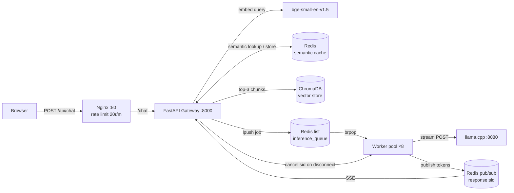

# Helix Chatbot — The Complete Guide

A start-to-finish walkthrough of this project: the concepts it's built on, how a
question travels through the system, and the real code behind every step. Read
it top to bottom once, then use the headers to jump back in as a reference.

> This doc teaches. For the terse architecture/config reference, see
> [`README.md`](../README.md). For a line-by-line, trace-to-source deep dive
> (measured numbers, failure modes, the "why" behind every constant), see
> [`docs/INTERVIEW.md`](INTERVIEW.md).

## Table of Contents

1. [What This Project Is](#1-what-this-project-is)
2. [Concepts Primer](#2-concepts-primer)
3. [The Big Picture](#3-the-big-picture)
4. [Walk Through One Request, Step by Step](#4-walk-through-one-request-step-by-step)
5. [File-by-File Reference](#5-file-by-file-reference)
6. [Configuration Reference](#6-configuration-reference)
7. [Why It's Built This Way](#7-why-its-built-this-way)
8. [Running It Yourself](#8-running-it-yourself)
9. [Testing](#9-testing)
10. [Glossary](#10-glossary)
11. [Where to Go Deeper](#11-where-to-go-deeper)

---

## 1. What This Project Is

Helix Chatbot is a **RAG (Retrieval-Augmented Generation) chatbot** that answers
questions about a college knowledge base — and it runs **entirely on local
hardware**. No OpenAI, no Anthropic, no external API calls of any kind. The
model, the vector database, and the cache all live on your machine.

Four moving pieces work together:

| Piece                | Role                                                              |
| -------------------- | ------------------------------------------------------------------ |
| **Nginx**            | Front door — rate-limits requests, serves the static chat page   |
| **Gateway**          | FastAPI web app — the "brain" that decides what to do with a query |
| **Worker pool**      | 8 background processes that actually talk to the LLM              |
| **Redis + ChromaDB + llama.cpp** | The infrastructure: job queue, cache, vector store, and the LLM itself |

The interesting engineering isn't the LLM call — it's everything *around* it:
deciding whether a question has already been answered (semantic cache),
finding the right knowledge to ground the answer in (retrieval), and streaming
the response back token-by-token without the web server ever blocking on a
slow model.

---

## 2. Concepts Primer

Read this section once. Everything in the rest of the doc builds on these seven ideas.

### RAG — Retrieval-Augmented Generation

An LLM by itself only knows what it was trained on — it's never heard of "HELIX"
or your college's course list. **RAG** fixes this by fetching relevant text from
your own documents *before* asking the model to answer, and stuffing that text
into the prompt as context:

```
prompt = "Here is some context: <retrieved chunks>. Using only this context,
          answer the user's question: <question>"
```

The model then answers *from the provided context* instead of guessing or
inventing facts. This is why the system prompt in this project (see §4.8) says
"do not invent facts that are not supported by the context."

### Embeddings & cosine similarity

An **embedding** is a list of numbers (a vector, e.g. 384 floats) that
represents the *meaning* of a piece of text. Two sentences that mean similar
things get vectors that point in similar directions — even if they don't share
a single word ("when is it?" vs. "when is HELIX?").

**Cosine similarity** measures how similar two vectors' directions are, from
-1 (opposite) to 1 (identical). This project uses it everywhere: to find
relevant document chunks, and to find a previously-asked, similar question in
the cache.

### Vector search: ANN, HNSW, KNN

Once you have thousands of embeddings, finding the closest one to a new query
by comparing it against *every single one* (a **linear scan**) gets slow —
cost grows directly with how many vectors you've stored.

**ANN (Approximate Nearest Neighbour)** search trades a tiny bit of accuracy
for huge speed: instead of checking everything, it uses a smart index
structure to jump straight to the neighbourhood of likely matches.
**HNSW** (Hierarchical Navigable Small World) is the specific algorithm used
here — both by ChromaDB (for document retrieval) and by Redis (for the cache).
**KNN** just means "K-Nearest-Neighbours" — this project always asks for
`KNN 1`, i.e. "give me the single closest match."

### Semantic cache

A normal cache matches on the *exact* input string. A **semantic cache**
matches on *meaning*: it embeds the incoming query and looks for a previously
cached query whose embedding is close enough (cosine similarity above a
threshold). That way, "What courses are offered?" and "Which courses do you
offer?" — different words, same intent — hit the same cached answer and skip
the LLM entirely.

### Job queue + pub/sub

A **job queue** is a list that one part of the system pushes work onto, and
another part pops work off of, one job at a time. Here, the Gateway pushes
"please answer this prompt" jobs, and idle Workers pop them off — this
decouples the fast, stateless web tier from the slow, resource-heavy LLM tier.

**Pub/sub** (publish/subscribe) is a separate mechanism: one side
`SUBSCRIBE`s to a named channel, another side `PUBLISH`es messages onto it,
and every subscriber receives them live. It has **no memory** — if you publish
before anyone has subscribed, that message is gone forever. This project uses
pub/sub to stream LLM tokens from a Worker back to the Gateway in real time.

### Server-Sent Events (SSE)

**SSE** is a simple way for a server to push a stream of text to a browser
over one ordinary HTTP connection — no WebSocket handshake needed. The
response body is just a sequence of lines like:

```
data: {"token": "Hello"}

data: {"token": " world"}

data: [DONE]

```

The browser reads the response stream as it arrives and reacts to each
`data:` line, which is exactly how tokens appear on screen as the model
"types."

### Chat templates & stop tokens

Raw LLMs don't understand "system/user/assistant" roles natively — that
structure is created by wrapping each message in special control tokens the
model was fine-tuned to recognize (e.g. `<|im_start|>user\n...\n<|im_end|>`
for Qwen-style models). Get the wrapper wrong and the model either ignores
your instructions or never stops generating. A **stop token** tells the
inference server "the model is done talking, cut it off here." Different
model families use different wrappers and stop tokens — this project calls
this pairing a **preset**.

---

## 3. The Big Picture

Two application processes — the **Gateway** and the **Worker pool** — never
call each other directly. They only ever communicate *through Redis* (a job
list + a pub/sub channel). Everything else is infrastructure they both lean on.



One line on each piece:

- **Nginx** — the only port exposed to the outside world (`:80`). Rate-limits
  and reverse-proxies to the Gateway; also serves the single static HTML
  frontend file.
- **Redis** — does three unrelated jobs at once: job queue (`LPUSH`/`BRPOP`),
  pub/sub (`SUBSCRIBE`/`PUBLISH`), and a vector-searchable cache
  (`FT.SEARCH`). One dependency, three roles.
- **ChromaDB** — an embedded (no server process) persistent vector database
  holding the chunked knowledge base.
- **llama.cpp** — runs on the *host*, not in a container, so it can use your
  GPU/Metal/CPU directly. The app talks to its HTTP `/completion` endpoint.

---

## 4. Walk Through One Request, Step by Step

This is the spine of the doc. Follow a single question — *"When is HELIX?"* —
as a follow-up in an ongoing conversation, from the browser to the model and
back.

### 4.1 Browser sends the query

The frontend is one vanilla-JS file, no build step. It generates a random
`conversationId` once per page load (this is what lets the backend remember
context across turns), then POSTs the query and reads the SSE stream back:

```javascript
// frontend/index.html
const conversationId =
  (crypto.randomUUID && crypto.randomUUID()) || String(Date.now());

async function ask(query) {
  const res = await fetch("/api/chat", {
    method: "POST",
    headers: { "Content-Type": "application/json" },
    body: JSON.stringify({ query, conversation_id: conversationId }),
  });
  const reader = res.body.getReader();
  const decoder = new TextDecoder();
  let buf = "";
  while (true) {
    const { value, done } = await reader.read();
    if (done) break;
    buf += decoder.decode(value, { stream: true });
    // ...split on blank lines, pull out `data: ...` frames, append tokens
  }
}
```

**Notice:** the conversation id is *client-generated and opaque* — the client
picks it, but never learns or controls anything about how the backend uses
it internally. That distinction matters in the next section.

### 4.2 Nginx rate-limits and proxies it

```nginx
# nginx/nginx.conf
limit_req_zone $binary_remote_addr zone=chatbot:10m rate=20r/m;

location /api/chat {
    limit_req zone=chatbot burst=10 delay=5;
    proxy_pass http://gateway_backends/chat;
    proxy_http_version 1.1;

    # SSE required headers
    proxy_set_header Connection '';
    proxy_buffering off;
    proxy_cache off;
    proxy_read_timeout 120s;
}
```

**Notice:** `proxy_buffering off` is essential for SSE — without it, Nginx
would wait to accumulate a full buffer before forwarding anything to the
browser, and tokens would arrive in one giant burst instead of streaming live.

### 4.3 FastAPI validates the request

```python
# gateway/main.py
class ChatRequest(BaseModel):
    query: str = Field(min_length=1, max_length=MAX_QUERY_LEN)
    # Opaque client-supplied memory key. Empty = stateless single turn.
    # NOTE: never used as the pub/sub channel name (that stays server-side).
    conversation_id: str = Field(default="", max_length=128)
```

Pydantic rejects anything outside 1–2000 characters before any code runs.
An empty `conversation_id` means "no memory — treat this as a standalone
question."

### 4.4 Load memory, rewrite the follow-up

```python
# gateway/main.py
session_id = str(uuid.uuid4())   # server-generated, NOT the conversation_id
...
history = await load_history(cid)
standalone = await rewrite_standalone(history, req.query)
```

Two different IDs are in play here — don't conflate them:

| ID                 | Who picks it | Purpose                                          |
| ------------------ | ------------ | ------------------------------------------------- |
| `conversation_id`  | client       | key for conversation memory (`conv:{id}` in Redis) |
| `session_id`       | **server**   | names the pub/sub channel for *this one request*   |

`rewrite_standalone` is the "when is it?" → "when is HELIX?" step. It's a
*separate, small, deterministic* LLM call — not the main answer generation:

```python
# gateway/main.py
async def rewrite_standalone(history: list[dict], query: str) -> str:
    if not history:
        return query          # first turn: no history, no model call at all
    convo = "\n".join(f"{m['role']}: {m['content']}" for m in history)
    messages = [
        {"role": "system", "content": REWRITE_INSTRUCTION},
        {"role": "user", "content": f"Conversation:\n{convo}\n\nFollow-up: {query}"},
    ]
    prompt = PRESET["render"](messages)
    payload = {
        "prompt": prompt,
        "n_predict": REWRITE_MAX_TOKENS,
        "temperature": 0.0,     # deterministic — same follow-up always rewrites the same way
        "stream": False,
        "stop": PRESET["stop"],
    }
    try:
        async with httpx.AsyncClient(timeout=30) as client:
            r = await client.post(LLAMA_URL, json=payload)
            text = (r.json().get("content") or "").strip()
        return text or query
    except Exception as e:
        print(f"[rewrite] failed ({e}); using raw query")
        return query           # never let the rewrite step break a request
```

The instruction it uses lives in `templates.py`:

```python
# gateway/templates.py
REWRITE_INSTRUCTION = (
    "Given the conversation so far and the user's follow-up, rewrite the "
    "follow-up as a single standalone question that makes sense without the "
    "conversation. Resolve pronouns and references. Output ONLY the rewritten "
    "question, nothing else."
)
```

**Why bother?** If you just glued the raw history onto the query, retrieval
would embed a messy blob of old turns instead of a focused question, and two
phrasings of the same follow-up ("when is it?" vs. "when's HELIX happening?")
would embed *differently* and miss each other in the cache. Rewriting first
means retrieval and caching both key off the same, clean *intent*.

### 4.5 Embed the resolved question

```python
# gateway/main.py
QUERY_PREFIX = os.getenv(
    "QUERY_PREFIX",
    "Represent this sentence for searching relevant passages: "
    if "bge" in EMBED_MODEL.lower()
    else "",
)

async def embed(text: str) -> list[float]:
    raw = await asyncio.to_thread(embedder.encode, [QUERY_PREFIX + text])
    return raw.tolist()[0]
```

Two details worth pausing on:

- `asyncio.to_thread` — encoding is CPU-bound work; running it in a thread
  keeps it from blocking FastAPI's event loop, which needs to keep serving
  *other* requests concurrently.
- The `QUERY_PREFIX` — the `bge-small-en-v1.5` embedding model was *trained*
  to expect a short instruction prefix on queries (but never on the documents
  being searched). Applying it only here — never in `ingest.py` — is what the
  model actually expects, and it's free (no extra inference cost).

### 4.6 Semantic cache lookup

```python
# gateway/main.py
cached = await get_cached(embedding)
if cached:
    await append_history(cid, req.query, cached)
    return StreamingResponse(stream_from_cache(cached), ...)
```

`get_cached` (in `cache.py`) hides two different implementations behind one
function, so the caller never needs to know which is active:

```python
# gateway/cache.py
async def get_cached(query_embedding: list[float]) -> str | None:
    if await _ensure_index(len(query_embedding)):
        return await _get_cached_knn(query_embedding)
    return await _get_cached_scan(query_embedding)
```

**The fast path** — Redis vector search, when the `redis:8` "Query Engine"
module is available:

```python
# gateway/cache.py
async def _get_cached_knn(query_embedding: list[float]) -> str | None:
    r = _get_redis_bytes()
    q = "*=>[KNN 1 @embedding $vec AS score]"
    res = await r.execute_command(
        "FT.SEARCH", INDEX_NAME, q,
        "PARAMS", "2", "vec", _to_bytes(query_embedding),
        "SORTBY", "score", "RETURN", "2", "score", "__key", "DIALECT", "2",
    )
    if not res or int(res[0]) == 0:
        return None
    ...
    distance = float(raw_score)
    similarity = 1.0 - distance          # Redis returns COSINE *distance*
    if similarity < SIMILARITY_THRESHOLD:  # 0.92
        return None
    ...
    return resp
```

**The fallback path** — a plain Python loop, used automatically if the Query
Engine isn't present (e.g. a bare-bones Redis):

```python
# gateway/cache.py
async def _get_cached_scan(query_embedding: list[float]) -> str | None:
    r = get_redis()
    best_sim = SIMILARITY_THRESHOLD
    best_key = best_response = None
    async for key in r.scan_iter(f"{KEY_PREFIX}*"):
        entry = await r.hgetall(key)
        stored = json.loads(entry["embedding"])
        similarity = _cosine_similarity(query_embedding, stored)
        if similarity >= best_sim:
            best_sim, best_key, best_response = similarity, key, entry["response"]
    ...
```

Which path runs is decided once, lazily, and cached in a module-level flag:

```python
# gateway/cache.py
async def _ensure_index(dim: int) -> bool:
    global _vector_ok
    if _vector_ok is not None:
        return _vector_ok
    try:
        await r.execute_command("FT.CREATE", INDEX_NAME, ..., "DIM", str(dim), ...)
        _vector_ok = True
    except ResponseError as e:
        _vector_ok = "Index already exists" in str(e)  # already created = still fine
    except Exception:
        _vector_ok = False   # no Query Engine → scan fallback
    return _vector_ok
```

So the gateway boots against *any* Redis and simply uses whichever backend is
present — this is why the vector index dimension is read from
`len(query_embedding)` rather than hardcoded: it adapts automatically if you
swap `EMBED_MODEL` for one with different dimensions.

A cache **hit** replays the stored answer as if it were streaming live
(so the UI looks identical either way), pacing it artificially:

```python
# gateway/main.py
async def stream_from_cache(cached_response: str):
    for token in re.findall(r"\S+\s*|\s+", cached_response):
        yield f"data: {json.dumps({'token': token})}\n\n"
        await asyncio.sleep(0.01)
    yield "data: [DONE]\n\n"
```

On a **miss**, we fall through to full RAG + inference.

### 4.7 Retrieve context from ChromaDB (on a cache miss)

```python
# gateway/main.py
async def retrieve_context(embedding: list[float]) -> str:
    results = await asyncio.to_thread(
        collection.query, query_embeddings=[embedding], n_results=TOP_K_CHUNKS,
    )
    # documents can be [] (empty collection) or contain None entries — filter
    # to real strings so an unpopulated/partial store degrades to "no context"
    # instead of crashing the whole request.
    docs = (results.get("documents") or [[]])[0] or []
    return "\n\n".join(d for d in docs if isinstance(d, str) and d)
```

`TOP_K_CHUNKS = 3` — the three most relevant chunks (by the same
cosine/HNSW search ChromaDB does internally) get concatenated into one
context string.

### 4.8 Build the model-specific prompt

```python
# gateway/main.py
def build_prompt(context: str, history: list[dict], query: str) -> str:
    system = {
        "role": "system",
        "content": SYSTEM_INSTRUCTION.format(college=COLLEGE_NAME, context=context),
    }
    return PRESET["render"]([system, *history, {"role": "user", "content": query}])
```

`SYSTEM_INSTRUCTION` (in `templates.py`) is what keeps the model grounded:

```python
# gateway/templates.py
SYSTEM_INSTRUCTION = (
    "You are a helpful assistant for {college}. "
    "Use the provided context and the conversation so far to answer. "
    "You may greet the user, and you may count, list, or summarize items that "
    "appear in the context. Do not invent facts that are not supported by the "
    "context; if the answer genuinely isn't there, say you don't have that "
    "information.\n\n"
    "Context:\n{context}"
)
```

Notice `*history` is spliced into the prompt *again* here (it was already
used for the rewrite in §4.4) — so pronouns resolve at generation time too,
not just at retrieval time.

`PRESET["render"]` wraps that message list in whatever control tokens the
configured model family expects. Each family is one small function, paired
with its own stop sequence so the two can never drift apart:

```python
# gateway/templates.py
def _qwen(messages):
    out = []
    for m in messages:
        out.append(f"<|im_start|>{m['role']}\n{m['content']}<|im_end|>\n")
    out.append("<|im_start|>assistant\n")
    return "".join(out)

PRESETS = {
    "phi3":   {"render": _phi3,   "stop": ["<|end|>", "<|user|>"]},
    "qwen":   {"render": _qwen,   "stop": ["<|im_end|>"]},
    "llama3": {"render": _llama3, "stop": ["<|eot_id|>"]},
}
```

Switching hardware/models is a one-word env var change (`MODEL_PRESET=qwen`)
— no code edit, because the wrapper and its stop tokens live in exactly one
place and both `main.py` (rendering) and `worker.py` (stop tokens sent to
llama.cpp) read from the same preset.

### 4.9 Subscribe before enqueueing the job

This is the most important ordering in the whole codebase:

```python
# gateway/main.py
# 4. Subscribe BEFORE enqueuing — Redis pub/sub has no backlog, so a worker
#    that publishes before we've subscribed would lose those tokens.
pubsub = redis_client.pubsub()
await pubsub.subscribe(channel)
job = {"session_id": session_id, "prompt": prompt}
await redis_client.lpush(QUEUE_KEY, json.dumps(job))
```

Recall from §2: pub/sub has no memory. If the job were pushed first, a fast
worker could grab it, start streaming, and publish the first few tokens
*before* the Gateway finishes subscribing — those tokens would vanish. Doing
it in this order guarantees the Gateway is listening before any token could
possibly be published.

### 4.10 A worker picks up the job and streams from llama.cpp

```python
# gateway/worker.py
async def worker(worker_id: int):
    while True:
        result = await redis_client.brpop(QUEUE_KEY, timeout=5)  # blocks until a job exists
        if result is None:
            continue
        _, raw_job = result
        job = json.loads(raw_job)
        await process_job(job)

async def main():
    tasks = [asyncio.create_task(worker(i)) for i in range(NUM_WORKERS)]  # 8 workers
    await asyncio.gather(*tasks)
```

`BRPOP` is a *blocking* pop — Redis hands each queued job to exactly one
waiting worker, so there's no risk of two workers grabbing the same job.

`process_job` does the actual streaming and enforces cancellation:

```python
# gateway/worker.py
async def process_job(job: dict):
    """Always publishes a terminal `[DONE]` (success, error, or cancel) so the
    gateway's stream generator can't hang waiting for a sentinel llama.cpp's
    /completion endpoint never sends."""
    session_id = job["session_id"]
    channel = f"response:{session_id}"
    cancel_key = f"cancel:{session_id}"

    try:
        if await redis_client.exists(cancel_key):
            return  # client already gone before we even started

        async with httpx.AsyncClient(timeout=120) as client:
            async with client.stream("POST", LLAMA_URL, json=payload) as response:
                seen = 0
                async for line in response.aiter_lines():
                    ...
                    token = data.get("content", "")
                    if token:
                        await redis_client.publish(channel, json.dumps({"token": token}))
                        seen += 1
                        if seen % CANCEL_CHECK_EVERY == 0 and await redis_client.exists(cancel_key):
                            return  # abort mid-stream: exiting closes the llama.cpp connection
                    if data.get("stop") is True:  # llama.cpp's real terminator
                        return
    except Exception as e:
        await redis_client.publish(channel, json.dumps({"error": str(e)}))
    finally:
        # End of stream / stop / cancel / error all converge here.
        await redis_client.publish(channel, "[DONE]")
```

Two subtle things to notice:

1. **llama.cpp's `/completion` endpoint never sends OpenAI's `data: [DONE]`
   sentinel** — it just ends the stream after a JSON object with
   `"stop": true`. The `finally` block is what guarantees a literal `[DONE]`
   always reaches the Gateway regardless of *how* the loop exits (normal
   finish, cancellation, or an exception) — otherwise the Gateway's generator
   would hang forever on a successful run.
2. **Cancellation is checked, not pushed.** The Gateway doesn't interrupt the
   worker directly; it just sets a flag (`cancel:{session_id}`) in Redis. The
   worker polls that flag every `CANCEL_CHECK_EVERY` (8) tokens and before
   starting at all. A client that disconnects mid-answer frees the worker
   within about 8 tokens instead of the model generating into the void.

### 4.11 Tokens stream back; the answer gets cached and remembered

Back in the Gateway, an async generator reads the pub/sub channel and
forwards each token as SSE:

```python
# gateway/main.py
async def stream_collect_cache():
    full_response = []
    completed = False
    try:
        while True:
            message = await pubsub.get_message(ignore_subscribe_messages=True, timeout=1.0)
            if await request.is_disconnected():
                await redis_client.set(cancel_key, "1", ex=CANCEL_TTL)
                break
            if message is None:
                continue
            data = message["data"]
            if data == "[DONE]":
                answer = "".join(full_response)
                await set_cache(embedding, answer)          # store for next time
                await append_history(cid, req.query, answer)  # remember this turn
                completed = True
                yield "data: [DONE]\n\n"
                break
            parsed = json.loads(data)
            token = parsed.get("token", "")
            full_response.append(token)
            yield f"data: {json.dumps({'token': token})}\n\n"
    finally:
        if not completed:
            await redis_client.set(cancel_key, "1", ex=CANCEL_TTL)  # e.g. we broke out early
        await pubsub.unsubscribe(channel)
        await pubsub.aclose()
```

Notice this is *also* where client disconnects are detected — the Gateway
polls `request.is_disconnected()` on the same loop that reads tokens, and
sets the cancel flag the worker is watching for (§4.10).

Memory is appended with a small atomic pipeline so the three writes
(push the two new messages, trim to the last N, refresh the TTL) can't
partially apply:

```python
# gateway/main.py
async def append_history(conversation_id: str, user_msg: str, assistant_msg: str):
    if not conversation_id:
        return
    key = f"conv:{conversation_id}"
    async with redis_client.pipeline(transaction=True) as pipe:
        pipe.rpush(key, json.dumps({"role": "user", "content": user_msg}),
                        json.dumps({"role": "assistant", "content": assistant_msg}))
        pipe.ltrim(key, -MAX_HISTORY_MSGS, -1)
        pipe.expire(key, CONV_TTL)
        await pipe.execute()
```

And back in the browser, the same SSE-frame parser from §4.1 appends each
token to the visible bubble as it arrives — that's the whole loop, closed.

---

## 5. File-by-File Reference

| File | Owns | Key functions/exports |
| ---- | ---- | ---------------------- |
| `gateway/main.py` | The FastAPI app: `/chat` (SSE endpoint), `/health`, conversation memory, query rewrite, cache-check orchestration, RAG retrieval, prompt building | `chat`, `rewrite_standalone`, `embed`, `retrieve_context`, `build_prompt`, `load_history`, `append_history`, `stream_from_cache` |
| `gateway/cache.py` | Semantic cache — vector KNN with a linear-scan fallback | `get_cached`, `set_cache` (public API); `_ensure_index`, `_get_cached_knn`/`_get_cached_scan` |
| `gateway/worker.py` | The async worker pool: dequeues jobs, streams llama.cpp, publishes tokens, honors cancellation | `worker`, `process_job`, `main` |
| `gateway/templates.py` | Per-model-family chat wrapper + matching stop tokens + the two system instructions | `PRESETS`, `get_preset`, `SYSTEM_INSTRUCTION`, `REWRITE_INSTRUCTION` |
| `ingestion/ingest.py` | Chunks `college_data.md`, embeds each chunk, loads it into ChromaDB | `chunk_text`, `hash_chunk`, `main`, `_selfcheck` |
| `ingestion/college_data.md` | The knowledge base source text (Markdown) | — |
| `nginx/nginx.conf` | Rate limiting, SSE-safe proxy headers, serves the static frontend | — |
| `frontend/index.html` | The entire chat UI: markup, styling, and the fetch+SSE client, in one file with no build step | `ask()`, SSE `frames()` generator |
| `docker-compose.yml` | Orchestrates `redis`, `gateway`, `worker`, `nginx`, and an on-demand `ingest` profile | — |
| `gateway/Dockerfile`, `ingestion/Dockerfile` | Multi-stage, non-root, CPU-only-torch images | — |
| `gateway/test_cache.py`, `gateway/test_templates.py`, `ingestion/ingest.py --selfcheck` | Pure-logic self-checks (no live services) run by CI | — |
| `gateway/bench_cache.py` | Measures KNN vs. linear-scan cache lookup latency | — |

### `ingest.py`'s chunking algorithm, explained

The knowledge base is one Markdown file. It needs to be split into small,
independently-embeddable pieces ("chunks") before ChromaDB can index it:

```python
# ingestion/ingest.py
CHUNK_SIZE = 500
CHUNK_OVERLAP = 100

def chunk_text(text: str):
    """Paragraph-packed chunks of ~CHUNK_SIZE with CHUNK_OVERLAP char carry-over."""
    # Hard-split oversized paragraphs so no unit exceeds CHUNK_SIZE.
    units = []
    for p in text.split("\n\n"):
        p = p.strip()
        if not p:
            continue
        while len(p) > CHUNK_SIZE:
            units.append(p[:CHUNK_SIZE])
            p = p[CHUNK_SIZE:]
        if p:
            units.append(p)

    chunks = []
    buffer = ""
    for u in units:
        if buffer and len(buffer) + len(u) + 2 > CHUNK_SIZE:
            chunks.append(buffer.strip())
            overlap = buffer[-CHUNK_OVERLAP:] if CHUNK_OVERLAP else ""
            buffer = overlap + "\n\n" + u   # carry trailing text into the next chunk
        else:
            buffer = buffer + "\n\n" + u if buffer else u

    if buffer.strip():
        chunks.append(buffer.strip())
    return chunks
```

In plain terms: it packs whole paragraphs together up to ~500 characters
(paragraphs are natural semantic units — better to keep one intact than to
cut it arbitrarily). If a single paragraph is *itself* too big, it gets hard
-split. Each new chunk starts with the last 100 characters of the *previous*
chunk, so an idea that happens to span a chunk boundary isn't lost from
either chunk's context.

Chunk IDs are content hashes:

```python
# ingestion/ingest.py
def hash_chunk(text: str):
    return hashlib.md5(text.encode()).hexdigest()
```

That means re-running ingestion after a small edit only re-embeds the chunks
that actually changed — unchanged chunk text hashes to the same ID, so
ChromaDB's `add()` is a no-op for it.

---

## 6. Configuration Reference

All tunables live at the top of the file that owns them — there's no central
config file. This mirrors the table in `README.md`/`CLAUDE.md`:

| File                  | Constant               | Default                            | Description                                                                        |
| --------------------- | ---------------------- | ----------------------------------- | ------------------------------------------------------------------------------------ |
| `gateway/main.py`     | `TOP_K_CHUNKS`         | `3`                                 | Chunks retrieved from ChromaDB per query                                           |
| `gateway/main.py`     | `COLLEGE_NAME`         | `ABC Institute of Technology`       | Injected into the system prompt (env `COLLEGE_NAME`)                                |
| `gateway/main.py`     | `MAX_QUERY_LEN`        | `2000`                              | Max accepted query length (chars)                                                    |
| `gateway/main.py`     | `MODEL_PRESET`         | `phi3`                              | LLM chat template + stop tokens (`phi3`/`qwen`/`llama3`); read by gateway + worker  |
| `gateway/main.py`     | `EMBED_MODEL`          | `BAAI/bge-small-en-v1.5`            | Embedding model; **must match** between gateway and ingestion                       |
| `gateway/main.py`     | `CONV_TTL`             | `3600`                              | Conversation-memory lifetime (seconds)                                              |
| `gateway/main.py`     | `MAX_HISTORY_MSGS`     | `12`                                | Messages kept per conversation (~6 turns)                                          |
| `gateway/main.py`     | `REWRITE_MAX_TOKENS`   | `64`                                 | Token budget for the standalone-question rewrite                                   |
| `gateway/cache.py`    | `SIMILARITY_THRESHOLD` | `0.92`                              | Cosine similarity required for a cache hit                                          |
| `gateway/cache.py`    | `CACHE_TTL`            | `604800`                            | Cache entry lifetime (7 days, in seconds)                                          |
| `gateway/worker.py`   | `NUM_WORKERS`          | `8`                                  | Parallel inference workers                                                         |
| `gateway/worker.py`   | `LLAMA_URL`            | `http://localhost:8080/completion`  | llama.cpp endpoint                                                                  |
| `ingestion/ingest.py` | `CHUNK_SIZE`           | `500`                                | Target characters per chunk                                                        |
| `ingestion/ingest.py` | `CHUNK_OVERLAP`        | `100`                                | Trailing characters carried into the next chunk                                    |

**Rule of thumb:** `MODEL_PRESET` is freely swappable via env var alone
(no re-ingestion needed). `EMBED_MODEL` changes vector dimensions — swapping
it requires re-running ingestion, or retrieval/cache similarity silently
breaks.

---

## 7. Why It's Built This Way

| Decision | Why |
| -------- | --- |
| Redis job queue + pub/sub, not Gateway → llama.cpp directly | Keeps the web tier stateless and responsive. Workers can scale independently, and a slow model call never ties up an HTTP connection. |
| Subscribe before enqueueing (§4.9) | Pub/sub has no backlog — reversing this order would silently drop the first tokens of every response. |
| `session_id` is server-generated, never client-supplied | It names the pub/sub channel. A client-chosen id would let one client subscribe to (eavesdrop on) another client's stream. |
| Query rewrite before retrieval (§4.4), not naive history-prepend | Keeps the retrieval embedding focused on one clean question, and lets the semantic cache key off *intent* rather than exact phrasing. Costs one extra (cheap, deterministic) LLM call per follow-up; skipped entirely on the first turn. |
| Chat template + stop tokens bundled as one "preset" (§4.8) | The two can never drift apart from each other, and switching model families is a single env var, not a code change spread across files. |
| bge query-prefix applied only to queries, never to stored documents | Matches how the `bge-small-en-v1.5` model was actually trained; a free retrieval quality boost. |
| Vector KNN cache with an automatic scan fallback (§4.6) | The gateway boots against *any* Redis. When the Query Engine module is present it gets near-flat lookup latency as the cache grows; otherwise it degrades gracefully instead of failing to start. |
| `[DONE]` published in a `finally` block (§4.10) | llama.cpp never sends its own terminator; this guarantees the Gateway's stream generator always terminates, on every exit path (success, error, or cancellation). |
| Local llama.cpp inference | Keeps all student/college data on-machine, removes per-token API cost, and runs the whole stack on a single GGUF file plus commodity hardware. |

---

## 8. Running It Yourself

```bash
# 1. Start llama.cpp on the HOST (outside Docker), pointing at any GGUF model
llama.cpp/build/bin/llama-server -m /path/to/model.gguf --port 8080

# 2. Ingest the knowledge base once (writes chatbot/data/chroma_db/)
cd chatbot/ingestion
uv sync
uv run python ingest.py

# 3. Start everything else
cd chatbot
docker-compose up
```

Then open `http://localhost/` for the chat UI, or:

```bash
curl -N -X POST http://localhost/api/chat \
  -H "Content-Type: application/json" \
  -d '{"query": "What courses are offered?"}'
```

Switching models later is just an env var, no rebuild:

```bash
MODEL_PRESET=qwen docker compose up -d
```

Full prerequisites, the without-Docker instructions, and per-hardware model
pairings are in [`README.md`](../README.md) — not duplicated here.

---

## 9. Testing

Every piece of logic that isn't obvious carries a small, dependency-free
self-check, and CI (`.github/workflows/ci.yml`) runs exactly these three —
with only `numpy` + `redis` installed, no `torch`/`chromadb` — so it stays
fast and needs no live services:

```bash
cd chatbot/gateway && uv run python test_cache.py       # cache: best-match + cosine guard
cd chatbot/gateway && uv run python test_templates.py   # presets: render + stop tokens present
cd chatbot/ingestion && uv run python ingest.py --selfcheck  # chunking: overlap + edge cases
```

What's deliberately **not** tested in CI: the real streaming/RAG path, since
that needs a live Redis and an actual GGUF model loaded in llama.cpp. That's
verified manually.

---

## 10. Glossary

| Term | Meaning |
| ---- | ------- |
| **RAG** | Retrieval-Augmented Generation — fetch relevant text, feed it to the LLM as context, so it answers from real data instead of guessing. |
| **Embedding** | A vector (list of numbers) representing a piece of text's meaning. |
| **Cosine similarity** | A measure (-1 to 1) of how similar two vectors' directions are; 1 = identical meaning. |
| **ANN** | Approximate Nearest Neighbour — fast, index-based vector search that trades a little accuracy for a lot of speed. |
| **HNSW** | Hierarchical Navigable Small World — the specific ANN algorithm used by both ChromaDB and Redis here. |
| **KNN** | K-Nearest-Neighbours — "give me the K closest matches" (this project always uses K=1). |
| **Semantic cache** | A cache keyed by meaning (embedding similarity) instead of exact string match. |
| **Pub/sub** | Publish/subscribe — a live broadcast channel with no backlog; messages published before a subscriber joins are lost. |
| **SSE** | Server-Sent Events — a one-way text stream from server to browser over plain HTTP. |
| **TTL** | Time To Live — how long a stored key survives in Redis before it auto-expires. |
| **BRPOP** | A blocking Redis command: pop from the right of a list, or wait (up to a timeout) until something is pushed. |
| **Chat template / preset** | The control-token wrapper (and matching stop sequence) a specific LLM family expects around role-tagged messages. |
| **Stop token** | A token/string that tells the inference server to end generation. |

---

## 11. Where to Go Deeper

- **[`README.md`](../README.md)** — architecture diagrams, the full sequence
  diagram, per-hardware model pairings, and the complete config reference.
- **[`docs/INTERVIEW.md`](INTERVIEW.md)** — a terse, `file:line`-referenced
  deep dive: measured cache-lookup benchmarks, Big-O analysis per component,
  every constant's exact rationale, real bugs that were found and fixed, and
  a rapid-fire Q&A format for interview prep. Read this *after* this guide,
  once the concepts and code flow here feel familiar — it assumes you
  already know the vocabulary this doc just taught you.
